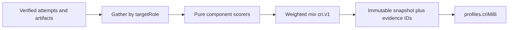

# Deterministic evidence-backed CRI

## Principle

PathED does not assign a career-readiness score. It **calculates** one from demonstrated evidence. CRI indicates **readiness for a target career**, not employability and not a hire recommendation. Every UI that shows CRI must carry that disclaimer.

Today [`profiles.cri`](src/lib/db/schema.ts) is an integer, and the **only write** is career-change skill overlap in [`src/lib/career/match.ts`](src/lib/career/match.ts) (`matched / roleSkills * 100`). Assessments, interviews, projects, and DSA already produce scores and are ignored. Placement still uses hardcoded `STUDENT_CRI = 62` in [`src/views/Platform/placement/inbox-data.ts`](src/views/Platform/placement/inbox-data.ts). Docs in [`src/views/Documentation/index.tsx`](src/views/Documentation/index.tsx) claim a multi-factor algorithm that does not exist.

## Formula (versioned)

```
CRI_milli = round( Σ (W_c * S_c) )     // 0–100000  →  display CRI = CRI_milli / 1000  (e.g. 78.263)
```

- `S_c` is a **0–100000 milli** component score (same precision as overall).
- Weights are **constants in code + docs**, never edited by staff or students.
- Formula id: `cri.v1` (Phase 1). Changing any weight or sub-weight **bumps the version** and produces a new snapshot; old snapshots stay auditable.

### Published model (target)

| Component | Weight | Phase 1 |
| --- | --- | --- |
| Technical / CS knowledge | 15 | Live |
| DSA and problem solving | 20 | Live |
| Projects and engineering | 15 | Live |
| Interview readiness | 15 | Live |
| Roadmap skill mastery | 10 | Live |
| Consistency / retention | 10 | Live |
| Resume / profile | 2 | Live |
| Open source | 5 | Reserved (v2) |
| Hackathons / competitions | 5 | Reserved (v2) |
| Certifications | 3 | Reserved (v2) |

Phase 1 **renormalizes the seven live weights to 100** (scale `100/87`) so the index is still 0–100. The audit trail still lists reserved components as `not_scored` with their future weights, so recruiters see what is missing from the full model.

Career scope: evidence is filtered to the student’s **current `targetRole`**. Unrelated DSA/topics, a previous-career roadmap, or interviews for another role do not count. After a career change with no matching evidence, career-scoped components are **0** (start from the beginning). Profile completeness stays global.



## Component math (no human 16/20)

All sub-weights below are constants. If a **sub-factor has no evidence**, it scores 0 and the audit lists `missing`. Do not invent cohort averages we do not store.

**DSA (canonical 20% of full model)** — from [`challenge_attempts`](src/lib/db/schema.ts) + [`problems`](src/lib/db/schema.ts) (`difficulty`, `careerTags`, `kind` coding):

- 30% accuracy: best-pass rate on distinct problems (retries do not inflate)
- 25% difficulty: share of solved set that is medium/hard, mapped to a published scale (e.g. easy 40, medium 70, hard 100)
- 15% unseen: first-attempt pass rate on problems never seen before
- 15% time: elapsed vs assessment `timeLimit` / `estMinutes` — **requires storing duration** on new attempts (historical rows without duration: this sub-factor is `missing` → 0)
- 10% consistency: rolling 28-day solve density, capped
- 5% retention: retest / spaced second-pass on a previously solved topic

**Knowledge (15%)** — MCQ/theory: [`roadmap_assessment_attempts`](src/lib/db/schema.ts) `type=mcq` + theory challenge attempts. Accuracy, difficulty, consistency. Same “best score per item” rule as progress ([`bestScoresByKey`](src/lib/progress/calculate.ts)).

**Projects (15%)** — [`project_runs`](src/lib/db/schema.ts) `score`, `checklistPct`, `rubricBreakdown`, `repoUrl`, GitHub inspector already used by [`src/lib/projects/grader.ts`](src/lib/projects/grader.ts). Blend: rubric score, checklist, presence of tests/docs in inspector, viva/reflection if present. Complexity from project `estimatedHours` / stack, not a rater’s gut.

**Interview (15%)** — [`interview_reports`](src/lib/db/schema.ts) `overall` + `scores` jsonb (`communication`, `problemSolving`, `codeQuality`, `depth`). Best report for current `targetRole`, with a small recency decay published in the formula (constant λ). Integrity flags from `interview_sessions.integrity` can cap, not boost.

**Roadmap mastery (10%)** — active roadmap: completed / trackable nodes, prerequisite satisfaction ([`allTrackableNodesSatisfied`](src/lib/roadmap/stats.ts)), mean **passed** assessment score on those nodes. Skill-name overlap is **not** the CRI.

**Consistency (10%)** — [`profiles.streak`](src/lib/db/schema.ts) + activity heatmap already built in [`src/lib/progress/service.ts`](src/lib/progress/service.ts): active days / window, improvement of rolling accuracy, drop-off penalty. XP is **not** a CRI input (avoid farming).

**Profile (2%)** — deterministic checklist: name, username, bio, institute, degree, github, linkedin, skills length, projects count, additionalCompleted. Each field a published point value summing to 100. No ATS ML in v1.

**v2 placeholders** (schema + UI only): verified PRs, hackathon rank, third-party certs. Score 0 / `not_scored` until tables exist.

## Storage and audit trail

Keep `profiles.cri` as a **rounded integer** for existing dashboard/copilot/public JSON so nothing breaks, and add the real value:

- `profiles.cri_milli` integer (78263 = 78.263%)
- `profiles.cri_formula` text (`cri.v1`)
- `profiles.cri_snapshot_id` uuid

New tables:

- `cri_snapshots`: `id`, `user_id`, `formula_id`, `target_role`, `cri_milli`, `components` jsonb (each: weight, scoreMilli, contributionMilli, status), `computed_at`, `trigger`
- `cri_evidence`: `id` (Evidence ID), `snapshot_id`, `component`, `source_type`, `source_id`, `metric`, `value_milli`, `weight_milli`

Recruiters/students click “Why 78.263?” → snapshot components → evidence rows (e.g. `challenge_attempts.id`, `interview_reports.id`, `project_runs.id`). Evidence IDs are stable UUIDs, not prose.

Recompute is **idempotent and pure**: gather facts → `computeCri(facts, FORMULA_V1)` → insert snapshot → update profile. Same facts always yield the same milli value (integer millipoints, no floats in the mixer).

## Write path (replace skill-coverage CRI)

[`applyCareerChange`](src/lib/career/apply-change.ts) must **stop writing** `previewCareerCri` into `profiles.cri`. Career change still updates role and deactivates the old roadmap; then it **recomputes CRI** for the new role (likely 0 if no matching evidence).

Hook `recomputeCri(userId, trigger)` after:

- roadmap assessment submit
- challenge / problem attempt
- project run submit
- interview report persist
- profile PUT (profile component only, cheap)

Student-only. Not on `/api/me` for other roles ([PLATFORM.md](docs/PLATFORM.md)).

## APIs and UI

- `GET /api/me/cri` — current snapshot + components + disclaimer. Student-only.
- `GET /api/me/cri/evidence?component=dsa` — evidence rows for that component.
- Public: extend [`GET /api/u/[username]`](src/app/api/u/[username]/route.ts) with `cri_milli` + formula id when visibility is public; keep integer `cri` for compat.
- Recruiter host is **not built**. Do not add recruiter UI under `/dashboard`. The student “Why CRI?” panel is the same contract recruiters will call later.

UI:

- [`CriGauge`](src/components/dashboard/home/CriGauge.tsx) / profile Career section: show **three decimals** from `cri_milli`, integer as secondary.
- New `WhyCriDialog`: stacked components, contributions, evidence links, reserved v2 rows, disclaimer: *CRI measures demonstrated readiness for this career. It does not guarantee a job or tell a recruiter to hire.*
- Replace marketing copy in Documentation that says CRI evaluates employability and “code linting / cohort speed” unless those inputs exist.

Placement inbox: wire live `student.criMilli` instead of `STUDENT_CRI = 62` where the page already has `useStudent()`; leave fake recruiter **messages** as mocks.

## Tests (the rigidity)

Pure tests in `src/lib/cri/` with fixed fixtures:

- Same attempts → bit-identical `cri_milli`
- Career B with zero overlapping problems → DSA/knowledge/roadmap 0
- Weight sum of live components after renormalize = 100000 milli
- Missing duration → DSA time sub-factor 0, not guessed
- Formula bump → old snapshot still loads

## Out of scope for this pass

- Recruiter product, admin CRI editor, cohort percentiles, lint/complexity static analysis, GitHub PR verification, hackathon rank ingestion, third-party cert ledger.
- Using XP/coins as CRI inputs.
