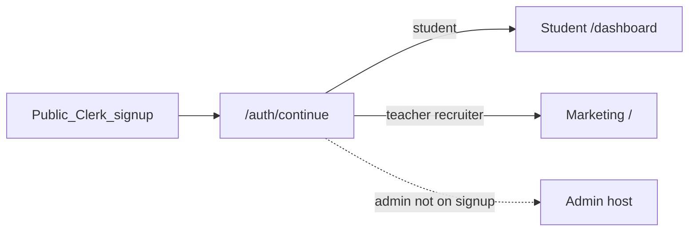

# PathED staff admin

This is the source of truth for the **staff ops console**. It is **not** the student platform, the teacher portal, or the recruiter product. Read [PLATFORM.md](PLATFORM.md) for audience hosts; this file is admin only.

**Status:** specified here. Not built. Do not add `admin` to code, signup, or `AppRole` until an implementation pass that follows this document.

## Why it is separate

The student product (`/dashboard`, `PortalShell`, `/api/me`) is a learner app. Staff need a different threat model: list and edit other users, inspect interviews, change roles, suspend accounts. That must never share student chrome, student nav, or student APIs.

Teacher / Educator / Mentor (`teacher`) is a **customer** product. Recruiter is a **customer** product. Neither is staff admin.

## Today

There is no admin UI, no `/admin` routes, and no `admin` role in [`src/lib/db/users.ts`](../src/lib/db/users.ts).

“Platform” in views and marketing means the **student** product:

- URLs: [`src/lib/routes.ts`](../src/lib/routes.ts) `routes.app` (`/dashboard`, `/onboarding`, `/profile`)
- Chrome: [`PortalShell`](../src/components/dashboard/PortalShell.tsx), owned by [`(portal)/layout.tsx`](../src/app/(app)/(portal)/layout.tsx)
- Gate: [`requireStudentPortal()`](../src/lib/server-auth.ts) — `role === "student"` only
- Public signup roles: [`AUTH_ROLES`](../src/components/auth/roles.ts) — `student` | `teacher` | `recruiter` only

Most `/api/*` handlers use `requireDbUser()` (any signed-in account). Layouts block the portal UI; they do not fully lock APIs. Admin implementation must not rely on that.



## Target product

Keep the current Next app as marketing + student (and future `/teacher` stand-in). Add a **second Next.js 15 app** in the same git repo. Share **database code only**. Do not move the whole student app into `apps/student-web` as a prerequisite for admin.

| Layer | Student platform | Staff admin |
| --- | --- | --- |
| App | current `src/app` | `apps/admin` |
| Local | `localhost:3000` | `localhost:3001` |
| Production host | `student.example.com` (today mixed on marketing origin) | `admin.example.com` |
| Shell | `PortalShell` | `AdminShell` only |
| Auth gate | `requireStudentPortal()` | `requireAdmin()` |
| Browser APIs | `/api/me`, `/api/roadmap`, `/api/ai`, `/api/store` | `/api/admin/*` on the **admin origin** |
| Database | Neon | Same Neon, admin queries + audit |
| Signup | Public student / teacher / recruiter | **None.** Promote in DB or email allowlist |

Forbidden imports in `apps/admin`: `components/dashboard/*`, `views/Platform/*`, `views/Dashboard/*`. Extend [`scripts/check-portal-shell.mjs`](../scripts/check-portal-shell.mjs) so the admin app cannot pull student chrome.

### Repo layout when implemented

```
apps/admin/
  src/app/                 # staff pages + /api/admin
  src/components/AdminShell
  src/middleware.ts
packages/db/               # extract from src/lib/db when splitting
src/                       # platform; thin re-exports of db so imports stay @/lib/db
```

Platform keeps `@/lib/db/...` via re-exports so admin does not require rewriting every student file.

## Role and auth

**Code today** stays:

```ts
type AppRole = "student" | "teacher" | "recruiter";
```

**When implementing**, extend to `"admin"` in DB + `AppRole` **and** update this file plus [PLATFORM.md](PLATFORM.md). Do **not** add Admin to `AUTH_ROLES` or the sign-up role picker.

How staff get the role:

1. Sign in on the **admin host** with an existing Clerk user (or a staff-only invite).
2. Promote with a script or `ADMIN_EMAILS` allowlist that sets `users.role = "admin"` on first admin login.
3. `requireAdmin()`: session + DB user + `role === "admin"` and not suspended.
4. Non-admins on the admin host: **hard deny** (403 / “not staff”). Never redirect them into `/dashboard`.
5. Admins who open the student origin: send them to the **admin origin**. Never render `PortalShell` for `admin`.
6. Students must not reach admin URLs even if they guess the host.

Clerk: **one application** first (same as PLATFORM.md), with the admin host on allowed origins. A **second Clerk application** for staff is optional later (stronger isolation).

Admin middleware: public `/sign-in` (and maybe `/`) only; everything else `auth.protect` then `requireAdmin()`.

## APIs

Admin HTTP lives **inside `apps/admin`**, same origin as the console. The student app’s browser must not call `/api/admin`. The admin browser must not call `/api/me` to manage other users.

When admin ships, student prefixes (`/api/me`, `/api/roadmap`, `/api/ai` except internal agent secrets, `/api/store`) must use **student-only** checks, not `requireDbUser()`.

| Prefix | Who |
| --- | --- |
| `/api/admin/users` | Staff. List, get, change role, suspend |
| `/api/admin/audit` | Staff. Read audit log |
| Future `/api/admin/interviews`, `/roadmaps`, `/content`, … | Staff. Not v1 |

Every mutating admin action writes `admin_audit_events` (actor, action, target, payload, time).

## Admin shell and nav

`AdminShell`: own sidebar + top bar. No Copilot FAB, no student tab bar, no marketing Header.

| Nav | v1 |
| --- | --- |
| Users | **Build this first** |
| Interviews | Placeholder |
| Roadmaps | Placeholder |
| Content | Placeholder |
| Analytics | Placeholder |
| Moderation | Placeholder |

Placeholders are labeled “not wired yet”. Do not fake data as if it were production.

### Users (first module)

- List/search: email, name, Student Registration ID, role
- Detail: profile snapshot, CRI/xp (`profiles`), wallet coins, recent `interviewSessions`
- Actions: change role (`student` / `teacher` / `recruiter` / `admin`) with extra confirm for `admin`; suspend (`users.suspendedAt` or equivalent)
- Reads existing tables in [`src/lib/db/schema.ts`](../src/lib/db/schema.ts). Writes go through admin services, not student onboarding mappers.

## Deploy and local DX (when built)

- `dev` — platform `:3000`
- `dev:admin` — admin `:3001`
- Two Vercel projects, same repo, different root; production `admin.*`
- No CORS to student APIs from the admin browser

## Out of scope

- Educator / recruiter customer UIs
- Full interview, roadmap, or content CRUD
- Splitting marketing vs student into two apps just to start admin
- Second Clerk production instance (follow-up)
- Adding `admin` to public signup

## Agent checklist

1. Is this staff ops? If yes, it belongs in `apps/admin` + `/api/admin`, not `(portal)`.
2. Would a student session hit this URL or API? If yes, stop.
3. Did you import `PortalShell` or `views/Platform`? Forbidden.
4. Did you add Admin to the sign-up role list? Forbidden.
5. Teacher is not admin. Recruiter is not admin.
