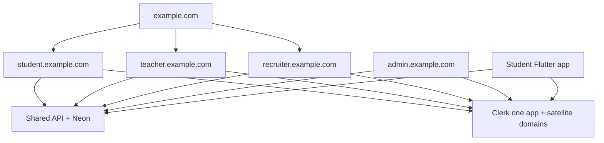

# PathED platform structure

This is the source of truth for **how PathED is split by audience**. Read it before adding routes, APIs, auth, or a new client. Product features belong in feature docs; this file is hosts, roles, ownership, and what not to mix.

The repo today is still **one Next.js 15 app** (marketing + Clerk + student portal) on a single origin. The **target** is one marketing site, three **customer** role platforms on their own hosts, a **staff admin** app on its own host, a shared database, and a student-only mobile app.

Staff ops: [ADMIN.md](ADMIN.md). Not built. Do not treat teacher or recruiter as admin.

## Audiences and hosts

| Login role (`AppRole`) | Production host | Product | Status |
| --- | --- | --- | --- |
| — (public) | `example.com` | Marketing / landing only | Built, currently mixed into this Next app |
| `student` | `student.example.com` | Student web | Largely built as `/dashboard` in this repo |
| `teacher` | `teacher.example.com` | Teacher portal | Not built. Login exists; post-auth sends teachers to `/` |
| `recruiter` | `recruiter.example.com` | Recruiter portal | Not built. Same home redirect |
| `admin` (specified only) | `admin.example.com` | Staff ops console | **Not in code.** Spec: [ADMIN.md](ADMIN.md). Local stand-in `:3001` when built |

Replace `example.com` with the real domain when it is set. Local stand-ins: one origin (`localhost:3000`) until apps are split; then `student.localhost`, `teacher.localhost`, `admin.localhost`, or separate ports.

### Role names (do not invent extra logins)

`AppRole` in [`src/lib/db/users.ts`](../src/lib/db/users.ts) is **only** (until admin is implemented):

```ts
type AppRole = "student" | "teacher" | "recruiter";
```

- **Teacher / Educator / Mentor** are the **same account**. Id is `teacher`. Mentorship is a teacher-portal feature, not a fourth signup, and **not staff admin**.
- Auth UI may still say “Educator”; do not add `educator` or `mentor` to `AppRole` without an explicit product change.
- **`admin` is specified in [ADMIN.md](ADMIN.md) only.** Do not add it to `AppRole`, Clerk signup (`AUTH_ROLES`), or the database until that implementation pass. Never put Admin on the public role picker.
- `users.role` is set on **first insert** from Clerk `unsafeMetadata.role`. Existing DB role wins after that.

Landing CTAs send the user to the **matching product host** sign-in. Marketing must not host student chrome (`PortalShell`, `/dashboard`).

## Current repo (do not pretend we already split)

```
src/app/(marketing)/     # public site
src/app/(auth)/          # Clerk sign-in / sign-up / continue
src/app/(app)/(portal)/  # student product; requireStudentPortal()
src/app/api/             # mostly student (/api/me, /api/roadmap, /api/ai, /api/store)
```

- Middleware ([`src/middleware.ts`](../src/middleware.ts)) is **auth vs public**, not role vs role.
- Student gate: [`requireStudentPortal()`](../src/lib/server-auth.ts) — non-students redirect to `/`.
- Post-auth: [`src/lib/auth-routing.ts`](../src/lib/auth-routing.ts) and [`src/lib/auth-routing-server.ts`](../src/lib/auth-routing-server.ts) — only students go to onboarding/`/dashboard`.
- Student chrome owner: [`src/app/(app)/(portal)/layout.tsx`](../src/app/(app)/(portal)/layout.tsx) → `PortalShell`. See [`.cursor/rules/portal-shell-ownership.mdc`](../.cursor/rules/portal-shell-ownership.mdc).
- Canonical student paths: [`src/lib/routes.ts`](../src/lib/routes.ts) `routes.app.*`.
- Schema: [`src/lib/db/schema.ts`](../src/lib/db/schema.ts) (Drizzle + Neon). Roadmaps and progress are **per-student `user_id`**. There are no class/roster/teacher-link tables yet.

Until the monorepo split ships, **new work must still respect platform boundaries**:

- Do **not** put teacher or recruiter UI under `/dashboard`.
- Do **not** let `/api/me/*` serve another role’s data.
- Teacher pages: `/teacher/...` (path prefix) is an allowed stand-in for `teacher.example.com`.
- Recruiter stays marketing-only until its app exists.
- Do **not** put staff admin under `/dashboard`, `/teacher`, or `/api/me`. See [ADMIN.md](ADMIN.md).

## Target monorepo

```
apps/
  marketing/          # example.com
  student-web/        # student.example.com  (today: most of src/)
  teacher-web/        # teacher.example.com
  recruiter-web/      # recruiter.example.com
  admin/              # admin.example.com — staff only; see ADMIN.md
  student-mobile/     # Flutter (Android + iOS)
packages/
  db/                 # Drizzle schema, migrations, queries
  api-contract/       # versioned HTTP contract + generated TS/Dart types
  auth/               # Clerk helpers, AppRole, require*Portal
```

Do **not** split apps until student HTTP APIs used by mobile are listed in `packages/api-contract`. Premature splits freeze student work.



## Auth (Clerk)

- **One Clerk application** for all web hosts and Flutter.
- Satellite / allowed origins: marketing + each role host.
- Sign-in **on the product host** (`student.example.com/sign-in`), not only on marketing (cookie / CORS issues).
- After session create: if `users.role` does not match the host, **redirect to the correct host**. Never show the student dashboard to a teacher “because they opened the URL”.
- Staff (`admin`, when implemented) sign in on `admin.example.com` only. Non-staff get a deny page, not `/dashboard`. Spec: [ADMIN.md](ADMIN.md).
- Student registration IDs (`PED-…`) are **students only**.

## APIs and data

One Neon database. Authorization is **role + resource**, not “logged in ⇒ `/api/me`”.

| Prefix | Who |
| --- | --- |
| `/api/me/*`, `/api/roadmap/*`, `/api/ai/*`, `/api/store/*` | Student-only today. Keep that invariant. Rename to `/api/student/*` only with a contract bump. |
| `/api/teacher/*` | Teacher. Must check an **active** teacher–student link before reading another user’s roadmap/profile. |
| `/api/recruiter/*` | Recruiter (future). |
| `/api/admin/*` | Staff. Lives on the **admin app origin**, not the student app. Spec: [ADMIN.md](ADMIN.md). |

**API host:** start with student-web (or the current Next app) serving `/api/*`. Teacher-web and Flutter call that origin with a Clerk session. A dedicated `api.example.com` is later.

If you change a student endpoint that mobile will use, **update the contract first**.

## Teacher portal (next web product, not built)

Teacher = command centre + mentorship, not a copy of the student app.

v1 intent:

- Own shell and nav (no student Copilot, no `PortalShell` from `(portal)`).
- Link students by **Student Registration ID**; student should **accept** before the teacher reads their roadmap.
- Read-only student roadmap; **verify** or **needs changes** + suggestions. Do not rewrite the student’s generated roadmap in v1.
- Mentorship: teacher profile, availability, sessions with **linked** students.

Student `/dashboard/mentorship` is still prototype fixtures. Do not block teacher v1 on replacing that directory.

Out of teacher v1: classes, assignments, grading, live video, recruiter UI.

## Student Flutter app (not started)

Flutter is the student **mobile** client (Android + iOS). It is **not** a WebView of Next.

Rules:

- Same users, same DB, same student APIs. No mobile-only database.
- Clerk Flutter SDK; reject non-`student` accounts.
- Mobile is a **subset** of web (home, roadmap, problems, interview, notifications). New experiments stay on web first.
- Do not start Flutter until auth, `/api/me`, roadmap, and progress are stable in the contract.

## Where to put new work

| You are building… | Put it… |
| --- | --- |
| Public marketing page | Marketing app / `(marketing)` — never student nav |
| Student screen | `(portal)` + `routes.app` + student APIs |
| Teacher screen | `/teacher` (later `apps/teacher-web`) + `/api/teacher` |
| Recruiter screen | Recruiter app when it exists — not student or teacher |
| Staff admin screen | `apps/admin` + `/api/admin` — never `(portal)`. [ADMIN.md](ADMIN.md) |
| Shared schema | `src/lib/db/schema.ts` (later `packages/db`) |
| Shared HTTP shape | `packages/api-contract` once it exists |
| Student mobile screen | `apps/student-mobile` after the contract exists |

## Agent checklist

1. Which **host / role** is this change for?
2. Does it leak another role’s data or chrome?
3. If it is student API used by mobile, did the **contract** change?
4. Did you mount a second portal shell? (Forbidden for student views.)
5. Teachers/recruiters still must not land in `/dashboard` unless product explicitly changes post-auth routing.
6. Staff admin is not teacher. Follow [ADMIN.md](ADMIN.md); do not add `admin` to signup.

## Suggested build order

1. This document (done) + keep student web complete.
2. Versioned student API contract.
3. Teacher web v1 in this repo (`/teacher` + `/api/teacher` + link/review tables).
4. Extract `packages/db` and `packages/api-contract`.
5. Split `apps/marketing` and `apps/student-web` when DNS/hosts exist.
6. Move teacher pages to `apps/teacher-web`.
7. Flutter against the contract.
8. Recruiter web last.
9. Staff admin per [ADMIN.md](ADMIN.md) (`apps/admin`, `/api/admin`, Users v1). Does not block teacher or Flutter. Do not start it by stuffing pages into `(portal)`.
