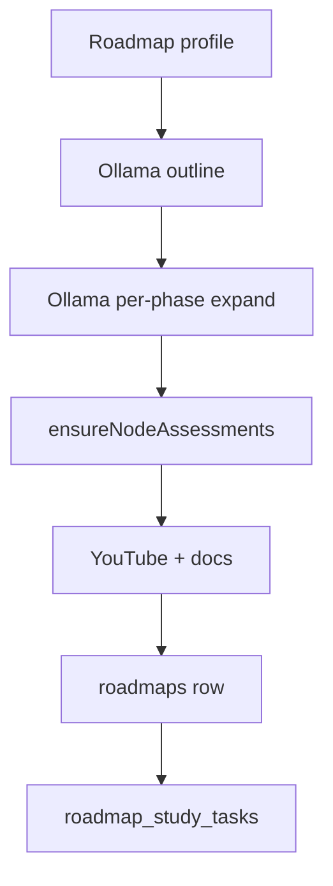

# Student roadmap

Student-only career path: nested skill graph, day plan, assessments, and a final AI interview. Host and role rules stay in [PLATFORM.md](PLATFORM.md). CRI scoring of roadmap evidence is in [CRI.md](CRI.md).

Screen: `/dashboard/roadmap` (`PlatformRoadmap` → `RoadmapCanvas`). APIs: `/api/roadmap/*` (student). Do not put teacher review UI here.

## What the student sees

1. Onboarding profile + follow-up questions (`/api/roadmap/profile`, `/api/roadmap/questions`).
2. Generate (or regenerate) a graph for `targetRole` / company.
3. Collapsed **spine**: goal → phases → projects / milestones → **final interview** node.
4. Click a phase (or nested skill) to expand **its children only**. One parent expanded at a time.
5. Study room on a node: overview, resources, notes, tutor. Playlist tab only if there is a YouTube URL.
6. Daily plan overlay (closed by default): IST calendar, today / backlog / upcoming.
7. Pass **all** assessments on a node to unlock dependents. Finish the path, then the gated interview.

Copy Chaicode-style **features** (calendar, backlog, check-off). Do not copy Chaicode layout.

## Graph model

Nodes live as JSON on `roadmaps.nodes` ([`src/types/roadmap.ts`](../src/types/roadmap.ts)).

| Field | Role |
| --- | --- |
| `parentId`, `depth` | Nesting. Spine = no parent, or type in `goal`, `phase`, `milestone`, `project`, `interview`, `career` |
| `subtopics[]` | Checklist in the detail panel |
| `whyLearn`, `learningOutcomes`, `interviewFocus` | Study copy + MCQ expansion |
| `gate: "final_interview"` | Certification interview node (`id` `final-ai-interview`) |
| `assessment` / `assessments[]` | Pass every item to complete the node |
| `source` | `generated` \| `remediation` \| `loop_refresh` |

Edges are a DAG (`source` → `target`). Layout positions are **not** stored from the model; Dagre computes them in the client.

**Do not cap node count** (generator, Zod `roadmapSchema.nodes`, or canvas). Hide children until expand; do not drop them.

## Generation (Ollama only)

Roadmap generate / regenerate / adapt / onboarding questions use **Ollama Cloud**. Not Groq, not Gemini.

[`src/lib/ai/roadmap-generator.ts`](../src/lib/ai/roadmap-generator.ts):

1. Outline: goal + phases (any number the role needs).
2. Expand **each phase** into topics (any number). Flatten with `parentId`.
3. Attach assessments, curated + YouTube resources, final interview node.
4. Persist via [`src/lib/roadmap/persist-generated.ts`](../src/lib/roadmap/persist-generated.ts). Seed the study calendar.

Invalid model JSON is sanitized (resource types, short graphs). Do not hard-fail a usable outline because Zod min/max used to be tight.



Two keys so interview and generate can run together (Cloud often serializes one request per key):

| Env | Purpose |
| --- | --- |
| `OLLAMA_ROADMAP_API_KEY` | Generate / adapt / questions |
| `OLLAMA_INTERVIEW_API_KEY` | Voice interview |
| `OLLAMA_API_KEY` | Fallback if a purpose key is empty |
| `OLLAMA_BASE_URL` | Default `https://ollama.com/v1` |
| `OLLAMA_ROADMAP_MODEL` / `OLLAMA_INTERVIEW_MODEL` | Default `gpt-oss:120b` |

Tutor, copilot, and notes stay on **Groq** (`GROQ_API_KEY`, [`src/lib/ai/llm.ts`](../src/lib/ai/llm.ts)). Do not route those through the roadmap Ollama key.

## Canvas

[`src/components/roadmap/RoadmapCanvas.tsx`](../src/components/roadmap/RoadmapCanvas.tsx)

- Visible set: spine + children of the **single** expanded parent.
- Layout: Dagre `TB` for that set. **No radial / sunburst.**
- Nested skill cards are compact; expanding a phase fits the camera to that cluster.
- Study planner starts collapsed.

## Study plan

Table `roadmap_study_tasks` (migration `drizzle/0016_roadmap_study_tasks.sql`). Logic: [`src/lib/roadmap/study-plan.ts`](../src/lib/roadmap/study-plan.ts). UI: `RoadmapStudyPlanner`. API: `GET`/`PATCH` `/api/roadmap/plan`.

- Calendar day = **Asia/Kolkata** (`istDateKey`).
- Pack trackable nodes into weekdays using profile `weeklyHours` (default 10h/week, skip interview node).
- Missed `planned` days become `backlog` (keep `sourceDate`).
- One row per `(user, roadmap, node)`.

## Videos

Optional `YOUTUBE_API_KEY`. Hits and oEmbed playability cache in `youtube_search_cache` / `youtube_oembed_cache` (`drizzle/0017_youtube_search_cache.sql`, TTL `YOUTUBE_CACHE_TTL_DAYS`, default 30). Empty searches expire in 24h.

Do not invent YouTube IDs in the LLM. Hide Playlist when the node has no video resources.

## Assessments

Built in [`src/lib/roadmap/assessment-bank.ts`](../src/lib/roadmap/assessment-bank.ts). Served at `/api/roadmap/assessment`, submit `/api/roadmap/assessment/submit`.

| Type | Pass | Notes |
| --- | --- | --- |
| `mcq` | `passScore` (typically 70%) | No question-count cap. Bank seeds plus subtopics / outcomes / interview focus. Time ≈ 1.5 min/question, max 180. |
| `coding` | 100% hidden+public tests | Pack problems, hydrated LeetCode-style fields |
| `project` | Rubric | Project nodes only |

GET `/api/roadmap` and assessment routes run `ensureNodeAssessments` and persist if nodes change (repair misaligned quizzes, expand short MCQs).

Proctoring: `NEXT_PUBLIC_ASSESSMENT_PROCTORING`.

## HTTP (student)

| Method | Path | Role |
| --- | --- | --- |
| GET/PUT | `/api/roadmap/profile` | Onboarding profile |
| POST | `/api/roadmap/questions` | Extra onboarding questions (Ollama) |
| POST | `/api/roadmap/generate?stream=1` | Create active roadmap |
| POST | `/api/roadmap/regenerate` | Replace graph |
| POST | `/api/roadmap/adapt` | Interview / fail loop |
| GET | `/api/roadmap` | Active graph + progress |
| GET/PATCH | `/api/roadmap/progress` | Node status |
| GET/PATCH | `/api/roadmap/plan` | Calendar / complete task |
| GET | `/api/roadmap/assessment` | Quiz/coding payload (secrets stripped) |
| POST | `/api/roadmap/assessment/submit` | Grade |
| GET | `/api/roadmap/list` | Switcher |
| POST | `/api/roadmap/switch` | Activate another saved path |

## Schema / migrate

```bash
npx tsx scripts/migrate-roadmap-study-youtube.ts
```

Applies `0016` + `0017`. Needs `DATABASE_URL` in `.env.local`. Also `npm run db:migrate:roadmap-study-youtube`.

## Agent checklist

1. Student-only. No teacher rewrite of generated nodes in this app.
2. Roadmap LLM = Ollama (`purpose: "roadmap"`). Interview LLM = Ollama (`purpose: "interview"`). Tutor = Groq.
3. Do not reintroduce node caps, sunburst layout, or MCQ `max(10)` / four-question banks as a hard limit.
4. Expand one parent at a time; keep all nodes in the JSON.
5. Keep `/api/me` off this feature; use `/api/roadmap`.
