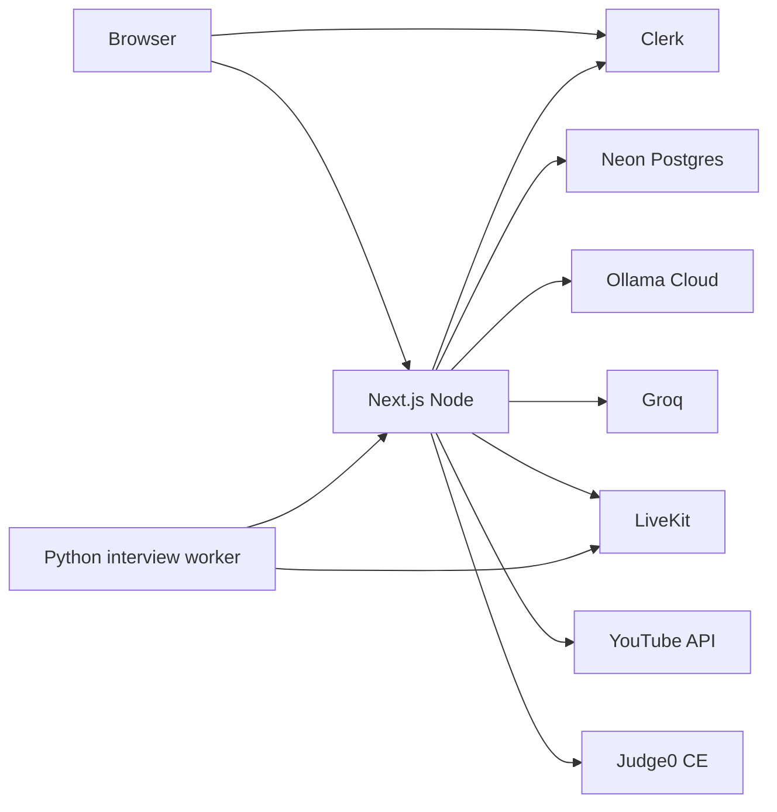

# Tech stack and hosting

Source of truth for **what PathED runs on today** and **where to deploy it**. Product splits: [PLATFORM.md](PLATFORM.md). Roadmap generate timeouts: [ROADMAP.md](ROADMAP.md).

The repo is **one Next.js app** (marketing + Clerk + student portal). Teacher / recruiter / staff admin are specified, not split out.

## Current stack

| Layer | Choice | Notes |
| --- | --- | --- |
| App | Next.js 15 (App Router), React 19, TypeScript | `next dev` / `next build` / `next start` |
| UI | Tailwind CSS v4, Framer Motion, Lucide | Student chrome: `PortalShell` |
| Roadmap canvas | React Flow (`@xyflow/react`) + Dagre | Client layout, not stored positions |
| Auth | Clerk (`@clerk/nextjs`) | One Clerk app; roles `student` \| `teacher` \| `recruiter` |
| Database | Neon PostgreSQL + Drizzle ORM | Server-only `DATABASE_URL` |
| Validation | Zod | API bodies + generated roadmap JSON |
| Roadmap / interview LLM | Ollama Cloud (`gpt-oss:120b`) | Two API keys so both can run at once |
| Tutor / copilot / notes | Groq | Not used for roadmap generate |
| Voice interview | LiveKit (Cloud or self-hosted) + Python worker | `npm run interview:agent` → `agents/interview` |
| News | Dev.to (free) + optional NewsAPI | Cached |
| Lesson video search | YouTube Data API + oEmbed cache | Optional key |
| Images | Unsplash remote patterns in `next.config.ts` | |
| Coding UI | Monaco Editor | Assessments / problems |
| Code execution | Node `vm` (JavaScript) + Judge0 CE (Python / Java / C / C++) | No PathED `/api/judge0` — see [Code judge](#code-judge-judge0) |
| Hosting (attempted) | Vercel Hobby | **Fails build:** `maxDuration` 800 on generate/regenerate; Hobby allows 1–300s |



Local: Node 20+ recommended, `npm install`, `.env.local` from `.env.example`, `npm run db:setup`, `npm run dev` → `http://localhost:3000`.

## Environment (server vs public)

**Never** prefix secrets with `NEXT_PUBLIC_`.

| Variable | Required to ship student app | Used for |
| --- | --- | --- |
| `DATABASE_URL` | Yes | Neon |
| `NEXT_PUBLIC_CLERK_PUBLISHABLE_KEY` | Yes | Browser Clerk |
| `CLERK_SECRET_KEY` | Yes | Server Clerk |
| `GROQ_API_KEY` | Yes for tutor/copilot/notes | Groq |
| `OLLAMA_ROADMAP_API_KEY` | Yes for generate | Roadmap LLM |
| `OLLAMA_INTERVIEW_API_KEY` | Yes for interviews | Interview LLM |
| `OLLAMA_API_KEY` | Fallback | If a purpose key is empty |
| `OLLAMA_BASE_URL` | Optional | Default `https://ollama.com/v1` |
| `LIVEKIT_URL` / `LIVEKIT_API_KEY` / `LIVEKIT_API_SECRET` | Yes for voice interviews | Rooms |
| `INTERVIEW_AGENT_SECRET` | Yes if worker is on | Worker → Next |
| `JUDGE0_API_URL` | Optional | Default `https://ce.judge0.com` |
| `JUDGE0_API_KEY` | Optional | Self-hosted Judge0 `X-Auth-Token` |
| `JUDGE0_RAPIDAPI_KEY` | Optional | RapidAPI Judge0 CE |
| `JUDGE0_RAPIDAPI_HOST` | Optional | Default `judge0-ce.p.rapidapi.com` |
| `YOUTUBE_API_KEY` | Optional | Search |
| `NEWS_API_KEY` | Optional | Extra headlines |
| `NEXT_PUBLIC_SITE_URL` | Optional | Absolute OG/sitemap URLs |
| `NEXT_PUBLIC_ASSESSMENT_PROCTORING` | Optional | Fullscreen/clipboard rules |

Clerk dashboard: add every production origin (`https://your.domain`, `https://www…`) as allowed. Sign-in must live **on the app host**, not only `accounts.dev`.

## Code judge (Judge0)

There is **no** PathED API named Judge0. The browser talks to our routes; the **server** then calls Judge0.

| Student action | Our route | What actually runs |
| --- | --- | --- |
| Run / submit **JavaScript** | `/api/roadmap/assessment/run` or `submit`, `/api/me/challenges/run` or `attempt` | **In-process Node `vm`** in [`coding-judge.ts`](../src/lib/roadmap/coding-judge.ts) — no Judge0 |
| Run / submit Python, Java, C, C++ | Same routes | [`code-runner.ts`](../src/lib/roadmap/code-runner.ts) `POST {JUDGE0_API_URL}/submissions?base64_encoded=true&wait=true` |

Default URL is the public Community Edition: `https://ce.judge0.com`. That instance is often **closed or RapidAPI-only**, so with empty env vars Python/Java/C++ fail with `Judge0 HTTP 401/429/…`. JavaScript still grades locally.

To actually connect Judge0, set one of:

1. **RapidAPI** — `JUDGE0_RAPIDAPI_KEY` (and optional host). Keep `JUDGE0_API_URL=https://judge0-ce.p.rapidapi.com` if you use that gateway.
2. **Self-hosted Judge0** on the VPS — `JUDGE0_API_URL=https://judge.your-domain.com` + `JUDGE0_API_KEY`.

The runner wraps the student’s function in a harness, sends one submission, parses JSON stdout as test results. It is not a Judge0 “account inside PathED.”

## Why Vercel Hobby broke

`src/app/api/roadmap/generate/route.ts` and `regenerate/route.ts` export `maxDuration = 800`. Hobby serverless allows **max 300 seconds**. The builder rejects the app before traffic.

Even if you cap at 300, a full nested generate (outline + one Ollama call per phase) often needs **more than 5 minutes**. The Python LiveKit worker also **cannot** run as a Vercel serverless function.

Keep **Neon, Clerk, Groq, Ollama Cloud, LiveKit Cloud** as SaaS. Only the **Node app + interview worker** need a machine that does not kill 10-minute requests.

## What to host where

| Piece | Keep as SaaS | Self-host only if |
| --- | --- | --- |
| Postgres | Neon (free tier is enough to start) | You want Hostinger MySQL — **don't**; this app is Postgres |
| Auth | Clerk | — |
| LLM | Ollama Cloud + Groq | You run GPU Ollama on a fat VPS (expensive) |
| WebRTC | LiveKit Cloud | You install LiveKit on the VPS |
| Code judge | RapidAPI Judge0 CE, or Judge0 Docker on the VPS | Public `ce.judge0.com` is not a reliable free API |
| Next.js | **Needs a Node host** | This is the decision below |
| Interview worker | Same Node VPS or a second small box | Must be a long-lived process |

**Hostinger shared / WordPress / “Web hosting” cannot run this.** No durable Node, no `next start`, PHP-only stacks. If you use Hostinger, buy **VPS (KVM)**, not shared hosting.

## Recommendation

### 1. Best cheap (pick this if you want Hostinger)

**Hostinger KVM 2 or KVM 4** (2–4 vCPU, **4 GB RAM minimum** — Next `next build` is heavy; 2 GB often OOM). Ubuntu 24.04.

Run:

- Node 22 + `npm ci && npm run build && npm start` (process manager: systemd or PM2)
- Nginx or Caddy reverse proxy + Let’s Encrypt
- Same box: Python venv + `npm run interview:agent` as a second service
- Point DNS A record at the VPS; add the URL in Clerk

No `maxDuration`. Generate can run until Ollama finishes or the process OOMs.

Similar price, often better network: **Hetzner CX22 / CX32** (EU). Same setup.

### 2. Best “I don’t want to SSH”

**Vercel Pro** — `maxDuration` can stay at 800; deploy stays Git-push. Still **does not** run the Python interviewer. Pair with LiveKit Cloud’s hosted agent **or** a tiny VPS/Railway service for `agents/interview` only.

### 3. Best free / almost free (tradeoffs)

| Option | Fits PathED? | Catch |
| --- | --- | --- |
| **Oracle Cloud Always Free** ARM (up to ~4 OCPU / 24 GB if the account gets it) | Yes — treat like Hostinger VPS | Signup often blocked; card + region lottery |
| **Railway** hobby | Yes — long-running Node, no 300s function cap | Free credit then pay; sleeps if you hit limits |
| **Render** free web service | Weak | Spins to zero; first request slow; HTTP timeouts |
| **Fly.io** free allowance | Possible | Small RAM; easy to exceed free |
| **Vercel Hobby** | **No** for generate as written | 300s cap + no Python worker |
| **Cloudflare Workers / Pages** | **No** | Not a long Node process; CPU limits |
| **GitHub Student Pack** | Credits toward the above | Still not a full production SLA |

**Practical free path:** keep **Neon + Clerk + Groq free tiers**. Put the **Next app on Oracle Always Free or Railway trial**. If Oracle signup fails, Hostinger/Hetzner KVM is cheaper than debugging free-tier sleep + timeouts.

Do not put Postgres on a 1 GB VPS next to Next.js if Neon free still works.

## VPS install sketch (Hostinger / Hetzner / Oracle)

Not run automatically; for when you provision the box.

```bash
# Ubuntu: Node 22, clone, env, build
sudo apt update && sudo apt install -y nginx python3-venv
# install Node 22 from NodeSource, then:
git clone <repo> /var/www/pathed && cd /var/www/pathed
cp .env.example .env.local   # fill secrets on the server only
npm ci
npm run build
# migrate once: npx tsx scripts/migrate.ts and feature migrate scripts
```

systemd `pathed.service`: `npm start` with `PORT=3000`. Proxy 443 → 3000. Separate unit for the interview agent.

Set Clerk production keys (not development) on that domain.

## What not to do

- Hostinger shared + “Node.js selector” without a real VPS — flaky, no worker, no long generate.
- MySQL on Hostinger instead of Neon — schema is Postgres.
- Cap generate at 300s and expect large nested maps to always finish on Hobby.
- Put `OLLAMA_*` or `DATABASE_URL` in `NEXT_PUBLIC_*`.
- Run `next build` on a 1 GB instance without swap.

## Related docs

| Doc | Topic |
| --- | --- |
| [PLATFORM.md](PLATFORM.md) | Hosts and roles |
| [ROADMAP.md](ROADMAP.md) | Generate, calendar, assessments |
| [CRI.md](CRI.md) | Scoring |
| [ADMIN.md](ADMIN.md) | Staff app (not built) |
